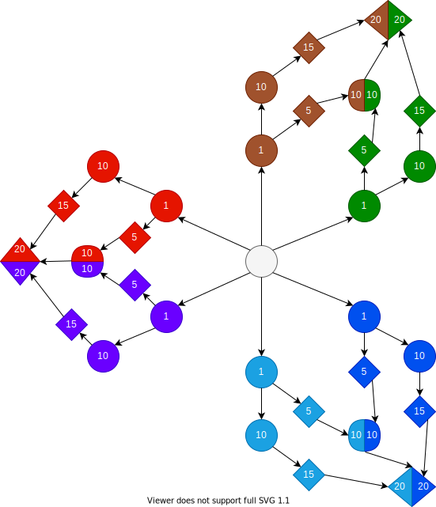

# Cosmo Crystal

## Spécifications :
* Type : RPG tour par tour
* POV : Third Person (Pikmin 3)
* Moteur : 3D
* Style graphique : Stylized shading

## Gameplay
* #### Combat :
	* ##### types :
		eau -> feu -> plante -> eau | normal | combat -> ténèbre -> psy -> combat
	* ##### attaques :
		
		* attaques de feu :
			* attaque simple basique (<strong>flammèche</strong>) _lv 1_ :
				* _petite boule de feu -> dégats unique_
			* attaque spé basique (<strong>orbe enflammé</strong>) _lv 5_ :
				* _sphère de feu -> dégats de zone_
			* attaque simple avancé (<strong>crocs de feu</strong>) _lv 10_ :
				* _morsure de feu -> dégats unique_
			* attaque spé avancé (<strong>déflagration</strong>) _lv 15_ :
				* _lance flamme -> dégats de zone_
			* QTE :
				* spam pour augmenter le curseur (doit rester dans la bonne partie de la jauge)
				* spam pour comprimé la boule de feu
		* attaques d'eau :
			* attaque simple basique (<strong>hydroslash</strong>) _lv 1_ :
				* _slash d'eau -> dégats unique_
			* attaque spé basique (<strong>aquapulse</strong>) _lv 5_ :
				* _jet laminaire d'eau -> dégats unique_
			* attaque simple avancé (<strong>noyade</strong>) _lv 10_ :
				* _une bulle d'eau qui englode les ennemis -> dégats de zone_
			* attaque spé avancé (<strong>hydroblast</strong>) _lv 15_ :
				* _un jet d'eau puissant -> dégats unique_
			* QTE :
				* style simon
				* parcours graph
				* suivre point avec un mouvement aléatoire
		* attaque de plante :
			* attaque simple basique (<strong>photo synthèse</strong>) _lv 1_ :
				* _une fleur que régen avec son pollen -> soin_
			* attaque spé basique (<strong>fouet liane</strong>) _lv 5_ :
				* _un fouet de liane -> dégats unique_
			* attaque simple avancé (<strong>éruption vénéneuse</strong>) _lv 10_ :
				* _des racines sortant du sol -> dégats de zone_
			* attaque spé avancé (<strong>tournesol</strong>) _lv 15_ :
				* _une fleur qui capte le soleil pour envoyer un rayon -> dégats unique_
			* QTE :
				* style osu catch
				* style osu taiko
				* dégats unique
		* attaque de ténèbre :
			* attaque simple basique (<strong>malédiction</strong>) _lv 1_ :
				* _une poupé maudite qui fait des dégats de status sur plusieurs tours -> dégats unique_
                	* attaque spé basique (<strong>fauchage</strong>) _lv 5_ :
                		* _une faucheuse qui fait des dégat ciblé à un ennemi -> dégats de zone_
                	* attaque simple avancé (<strong>épines ténébreuses</strong>) _lv 10_ :
                		* _un mur d'épines qui partent graduellement en direction des ennemis aléatoirement -> dégats de zone_
                	* attaque spé avancé (<strong>distortion</strong>) _lv 15_ :
                		* _une singularité qui créé une distortion infligeant des dégats conséquant à l'ensemble des ennemis -> dégats de zone_
			* QTE :
				* suite de séquences de symboles à entrer dans le bon ordre
		* attaque de combat :
			* attaque simple basique (<strong>éclat poing</strong>) _lv 1_ :
				* _une boule de roche apparait et le joueur frappe dedans pour l'envoyer dans l'ennemi -> dégat unique_
			* attaque spé basique (<strong>choc télurique</strong>) _lv 5_ :
				* _une onde de choc qui fait des dégats à tous les ennemis -> dégats de zone_
			* attaque simple avancé (<strong>frappe éclair</strong>) _lv 10_ :
				* _le joueur se déplace rapidement sur l'ennemi pour le frapper -> dégats unique_
			* attaque spé avancé (<strong>ultra poing</strong>) _lv 15_ :
				* _le joueur concentre sont pouvoir pour frapper à distance l'ennemi -> dégats unique_
			* QTE :
				* suite de touche à faire rapidement
		* attaque de psy :
	* ##### level design :
		* biomes : 
			<strong>généralités</strong> : Les biomes sont de différents types et contiennent des créatures de leurs type _(forêt contient des créatures de type plante)_. Certains biomes peuvent être de deux types différents est servir d'habitation à des créatures multitypes plus puissantes.
		* donjons : 
			* <strong>généralités</strong> : Les donjons sont rempli de monstres de tout les types différents. Ceux ci contiennent des énigmes dont la résolution permet de progresser dans les différentes pièces et étages.
		* abilitées :
			* <strong>morsure</strong> : une abilité permettant de détruire un éléments faibles (feuillage, racien, etc...) / _type normal_
			* <strong>boule de feu dirigé</strong> : une boule de flamme permettant d'actionner un reseau d'éléments (alumer un reseau de torche, etc...) / _type feu_
			* <strong>pikmin troups</strong> : une petite araignée controllable et passe partout. / type psy
			* <strong>grappin liane</strong> : un grappin permettant de traverser des obstacles. / type plante
			* <strong>respi-bulle</strong> : une bulle d'air permettant de respirer sous l'eau indéfiniment. / type eau
		* énigmes :
			* <strong>salle sombre</strong> : le joueur peut acquérir des capacités liées au type exemple feu flammèche -> Activer les torches
			* <strong>puzzle de torches</strong> : Activer plusieurs torche lui permet d'ouvrir une portes/faire apparaître un coffre
			* <strong>fossé franchissable avec grappin</strong> : 
	* ##### items et marchands :
		* items :
			* <strong>items de buff</strong> : le joueur pourra acheter des des objets spéciaux à des marchands, il pourra en porter un au maximum et  il lui donnerons un buff au détriment d'un débuff. 
## Histoire
* #### Contexte :
	L'intrigue de l'histoire ce déroule dans un monde séparé en quatre continents, celui de la neige, de la forêt, du feu et celui de la mer. Divers espèces de monstres y vivent, chacune ayant des attribues spécifiques à leurs habitats. Un type de monstres  plus exotique existe aussi dans ce monde, il s'agit des monstres de cristaux, le joueur est lui même un monstre de ce type. Ces monstres n'apparaissent que très rarement (tout les quatre millénaire environ) et sortent du sol tous en même temps durant une période que l'on appelle <strong>l'éclosion</strong>. Du fait de la rareté de ces monstres et de leurs propriétés métaboliques, ceux-ci sont énormément chassé par <strong>les humains</strong> durant cette phase où ils sont les plus simples à tuer, le temps le rendant rapidement beaucoup trop puissant. Autrefois, ces créatures étaient protégé par un immense champs de protection infranchissable qui rendais leur lieu d'éclosion inattaquable jusqu'à ce qu'il atteigne l'age adulte et devienne de majestueuses et très puissante créature. Malheureusement, il y a de ça 20 000 ans, un groupe d'humains parvient à détruire le générateur et à canalisé toute sa puissance dans un artéfact appelé 'la relique du chaos', nommé ainsi par les humain du fait de la puissance quelle contient et de la quantité d'énérgie libéré lors de la destruction du champ de force, créant une onde de choc de 10 sur l'échelle de Richter sur l'ensemble des quatre continents et prenant d’innombrable vies humaines. Cet artefact est aujourd'hui enfermé dans les tréfonds du plus grand temple humain, là ou personne n’oserait pénétrer.
* #### Objectif :
	Le héros étant un monstre de cristal venant de naitre, il doit dans un premier temps prendre en considération le monde qui l'entour, il devra donc interagir avec certains élément de l'environnement et avec les PNJs plus ou moins amicaux qui peuple le monde (La traitrise et la manipulation par les PNJs sera beaucoup mise en avant pour faire comprendre au joueur l'envers du décors, il devra donc faire attention à qui il peut faire confiance). Au fil de son aventure qui consistera en grande partie à récupérer des informations et résoudre des énigmes dans les quatre donjons élémentaires situés chacun dans un contient. Après avoir pris connaissance de l'histoire du champs de force et de la relique. Le joueur apprendra que celle ci est enfermé dans le grand temple humain depuis 20 000 ans. Le grand temple humain fera office de donjon final et pourra être accessible au joueur uniquement après qu'il ai terminé les quatre donjons élémentaires, libérant alors assez d’énergie dans le monde pour activer la porte du temple. Arrive alors la partie final du jeu où le héros se retrouvera confronté à de multiples pièges et créatures plus puissants les uns que les autres pour enfin atteindre la relique et rétablir le champ de force.
* #### Joueur :
	Le joueur démarre la partie sur l'éclosion de son avatar en brisant le cristal-œuf dans lequel il a été incubé durant des millénaires. Il prend la forme d'une petite araignée ornée de cristaux répartie partout sur ça carapace.
* #### Caractéristiques des créatures :
	* ##### les créatures de cristal :
		Ces créatures extrêmement rare ne naissent que tous les 4000 ans et sont ornées de cristaux très rare et puissant beaucoup convoitées par les humains. Il possède également un noyaux d’énergie très puissant qu'ils peuvent utiliser pour contrôler momentanément une créature carboné _(cf : gameplay ally)_ ou encore pour s'approprier les compétences élémentaires des environnement qu'il traverse _(cf : gameplay compétences élémentaires)_.
	* ##### les créatures carbonés :
		Ces créatures sont les plus courante dans le monde et possèdent des caractéristique propre à leurs environnement _(Eau, Feu, Plante, Psy, Ténèbre, Combat)_. Ils peuvent être relativement hostile avec le joueur et peuvent lui poser problème suivant son type prédominant.
* #### PNJs principaux :
	* ##### Échidna :
		Cette créature moitié femme moitié serpent est un personnage rencontré par le jouer au début de la partie. Celui-ci la voit en difficulté face à un groupe de chasseur humains. Le joueur et alors accompagné de son acolyte Lanthel _(personnage tuto, créature de cristal né au même moment)_ et observe la scène de loin. La créature humanoïde semblant montrer des signes de faiblesse et implorant de l'aide, Lanthel se précipite alors pour s’interposer entre les humains et la créature. C'est alors qu'il reçoit un coup mortel de la part du la femme serpent qui fait alors fuir les humains. Le héros resté à l'écart prend peur et se sauve _(cette cinématique permet de mettre fin au tutoriel de base et permet de montrer au joueur l'envers du décor)_.
		
		* Information sur le personnage :
			_Échidna est une ancienne esclave des humains qui cherche à se venger en exterminant les humains. C'est pour cela qu'elle se met en quête de la relique du chaos après avoir appris son existence par une erreur du joueur._  
	* ##### Argo :
		Argo est un chasseur humain dont l'objectif est de traquer Échidna du fait de la prime sur ça tête, c'est un personnage grossier qui ne porte pas réellement d'intérêts au joueur.
	* ##### Lanthel :
		Tout comme le joueur, Lanthel est une créature de cristal, il éclos au même moment que le joueur non loin de lui. Il servira de tutoriel basique au joueur avant de se faire violemment tué par Échidna peut de temps après.
## Developpement
* #### design pattern :
	[les design patterns du jeu-vidéo](https://slides.com/red-red/les-design-patterns-du-jeu-video/fullscreen)

